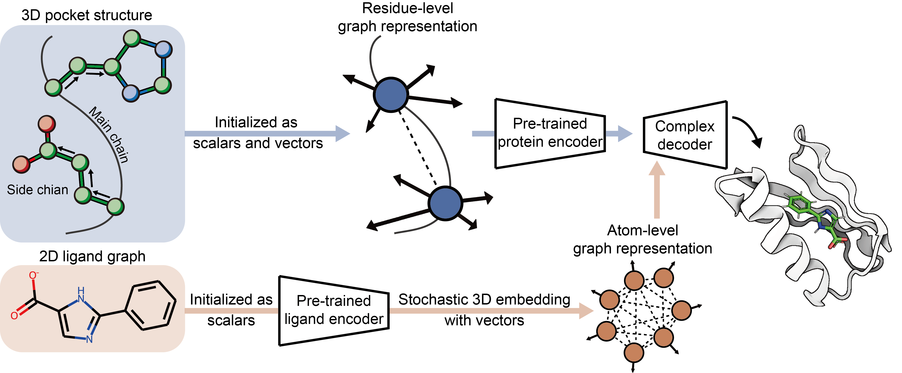

# FlexPose

### [FlexPose](https://pubs.acs.org/doi/10.1021/acs.jctc.3c00273), a framework for AI-based flexible modeling of protein-ligand binding pose.



***A free light-weight web server can be found [here](https://www.knightofnight.com/sl/FlexPose).***

<details open><summary><b>Table of contents</b></summary>

- [Installation](#installation)
- [Usage](#usage)
  - [Prediction](#prediction)
  - [Training](#training)
    - [Data augmentation](#data-aug)
    - [Data preprocessing](#data-preprocessing)
    - [Train your own model](#train-your-own-model)
  - [Model confidence visualization](#model-confidence-visualization)
- [License](#license)
- [Citation](#citation)
</details>


## Installation <a name="installation"></a>
### Install prerequisite packages
FlexPose is implemented in PyTorch. All basic dependencies are listed in `requirements.txt` 
and most of them can be easily installed with `pip install`. 
We provide tested installation commands in `install_cmd.txt` for your reference.

### Install FlexPose pacakge
  ```pip install -e .```

## Usage <a name="usage"></a>

### Prediction <a name="prediction"></a>

You can use the FlexPose as follows in `demo.py`:

```python
from FlexPose.utils.prediction import predict as predict_by_FlexPose

predict_by_FlexPose(
    protein='./FlexPose/example/4r6e/4r6e_protein.pdb',               # a protein path, or a list of paths
    ligand='./FlexPose/example/4r6e/4r6e_ligand.mol2',                # a ligand path (or SMILES), or a list of paths (or SMILES)
    ref_pocket_center='./FlexPose/example/4r6e/4r6e_ligand.mol2',     # a ligand-like file for selecting pocket, e.g. predictions from Fpocket
    # batch_csv='./FlexPose/example/example_input.csv',               # for batch prediction

    device='cuda:0',                                                  # device
    structure_output_path='./structure_output',                       # structure output
    output_result_path='./output.csv',                                # record output
)
```

|Arguments | Description                                              |
|----------|----------------------------------------------------------|
| `protein` | Input proteins (a list of paths)                         |
| `ligand`  | Input ligands (a list of paths)                          |
| `ref_pocket_center` | Ligand-like files for pocket selection (a list of paths) |
| `batch_csv` | Batch prediction                                         |
| `ens` | Ensemble number                                          |
| `structure_output_path` | A folder for saving predicted structures                 |
| `output_result_path` | A csv file for saving records                            |
| `min` | Energy minimizion                                        |
| `min_loop` | Energy minimizion loops                                  |
| `min_constraint` | Constraint energy minimizion constant (kcal/mol/Å^2)     |
| `batch_csv` | Batch prediction                                         |
| `device` | Device                                                   |
| `batch_size` | Batch size                                               |
| `prepare_data_with_multi_cpu` | Prepare inputs with multiprocessing                      |


### Training <a name="training"></a>

Here, we provide a pipeline for training a model on the PDBbind and APObind datasets, 
and it is recommended to run these scripts in the root directory of FlexPose.

#### Data augmentation (Optional) <a name="data-aug"></a>
We use Rosetta to generate fake apo conformations from holo conformations. For each training iteration, 
there is a small probability that the model is trained with these fake conformations.
  ```sh
  python FlexPose/preprocess/aug_pseudo_apo.py \
  --apobind_path path/to/apobind \
  --pdbbind_path path/to/pdbbind \
  --save_path path/for/saving \
  --n_rand_pert 3 \
  --n_fixbb_repack 3 \
  --n_flexbb_repack 3
  ```
You need to set `--apobind_path` and `--pdbbind_path` to path of the decompressed APObind and PDBbind, 
and set the `--save_path` to a folder to save data augmentation.

NOTE: Generating all conformations takes hours to days (depending on the number of CPU cores used).
We recommend performing the data augmentation on computers with multiple CPU cores. 
Alternatively, you can set `--n_rand_pert`, `--n_fixbb_repack` and `--n_flexbb_repack` to 0 to skip most of the processing.


#### Data preprocessing (Optional) <a name="data-preprocessing"></a>
After data augmentation, now we can generate input files for training:
  ```sh
  python FlexPose/preprocess/prepare_APOPDBbind.py \
  --apobind_path path/to/apobind \
  --pdbbind_path path/to/pdbbind \
  --save_path path/for/saving \
  --apo_info_path path/to/apobind_all.csv \
  --aff_info_path path/to/INDEX_general_PL_data.{year} \
  --aug_path path/to/data/augmentation \
  --tmp_path ./tmp \
  --max_len_pocket 150 \
  --max_len_ligand 150
  ```
You need to set `--apobind_path` and `--pdbbind_path` to path of the decompressed APObind and PDBbind (same settings as in the data augmentation), 
and set the `--save_path` to a new folder to save preprocessed data. 
`--apo_info_path` is the path to `apobind_all.csv`, which is provided by APObind.
`--aff_info_path` is the path to `INDEX_general_PL_data.{year}`, which is provided by PDBbind.

NOTE: Set `--max_len_pocket` and `--max_len_ligand` to a small number (e.g. 64) to get a toy dataset, which can speed up training.

#### Train your own model <a name="train-your-own-model"></a>
If you want to skip data augmentation and data preprocessing, the preprocessed data can be found 
[here](https://1drv.ms/u/c/469b767efa9cca5a/EWPDY3ymuEtAnY1e6rXlt0EB_U7uXvDihaTvrH6NkN1aeg?e=v1UfN8).
Now, we can train a toy FlexPose by running:
  ```sh
  python FlexPose/train/train_APOPDBbind.py \
  --data_path path/to/preprocessed/data \
  --data_list_path path/to/data/split \
  --batch_size 3 \
  --lr 0.0005 \
  --n_epoch 200 \
  --dropout 0.1 \
  --use_pretrain False \
  --c_x_sca_hidden 32 \
  --c_edge_sca_hidden 16 \
  --c_x_vec_hidden 16 \
  --c_edge_vec_hidden 8 \
  --n_head 2 \
  --c_block 2 \
  --c_block_only_coor 1
  ```
You need to set the `--data_path` to the preprocessed data and set the `--data_list_path` to a path for saving splited data IDs.

Besides, you can set `--use_pretrain` to `True` to use pre-trained encoders, 
and set (`--pretrain_protein_encoder`, `--pretrain_ligand_encoder`) to the path of pre-trained parameters, respectively 
(or set them to `None` to load our pre-trained encoders). 
We freeze pre-trained parameters by default to improve training efficiency.


## Model confidence visualization <a name="model-confidence-visualization"></a>


You can visualize model confidence with PyMol:
```pymol
spectrum b, red_white_green, minimum=0, maximum=1
```


## License <a name="license"></a>
Released under the MIT license.

## Citation <a name="citation"></a>
If you find our model useful in your research, please cite the relevant paper:
```
@article{dong2023equivariant,
  title={Equivariant Flexible Modeling of the Protein--Ligand Binding Pose with Geometric Deep Learning},
  author={Dong, Tiejun and Yang, Ziduo and Zhou, Jun and Chen, Calvin Yu-Chian},
  journal={Journal of Chemical Theory and Computation},
  year={2023},
  publisher={ACS Publications}
}
```


